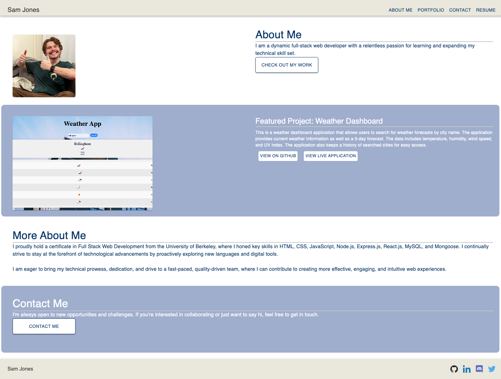

# Sam Jones Portfolio

  
  
  ## URL
  
  https://particularspace.github.io/sam-jones-portfolio/

  ## Description

  I portfolio to showcase my work and skills.

  ## Table of Contents

  - [Installation](#installation)
  - [Usage](#usage)
  - [Images](#images)
  - [Credits](#credits)
  - [License](#license)
  - [Tests](#tests)
  - [Questions](#questions)

  ## Installation

  N/A

  ## Usage

  Navigate using the header or buttons on screen!
  
  ## Images
  
  
  
  ## License

 This project is licensed under the MIT license. To learn more please visit https://choosealicense.com/licenses/mit/

  ## Credits

  Sam Jones,
  Stack Overflow,
  MDN,

  ## Tests

  N/A

  ## Questions

  If you have any questions about the repo, open an issue or contact me directly at [samejones2018@gmail.com](mailto:samejones2018@gmail.com). You can find more of my work at [ParticularSpace](https://github.com/ParticularSpace).

